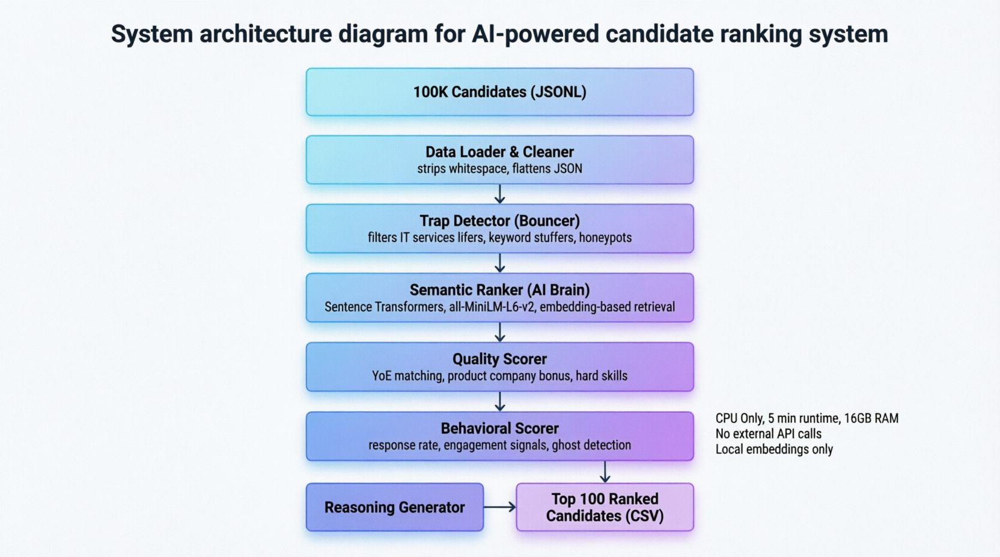

# 🚀 Redrob AI Ranker 

> **Hackathon Submission:** India Runs Data and AI Challenge  
> **Goal:** Sift through 100,000 candidate profiles to find the absolute Top 100 engineers for a specialized AI/Search role.



## 🌟 Overview

The **Redrob AI Ranker** is a blazing-fast, CPU-only candidate ranking pipeline designed to solve the "needle in a haystack" hiring problem. It takes a massive JSONL dataset of 100,000 candidates and distills them into the top 100 perfect matches in **under 5 minutes**. 

Instead of relying on slow, expensive LLM calls for every candidate, this pipeline uses a smart **Funnel Architecture**:
1. **The Bouncer (Trap Detector):** Instantly eliminates "honeypots", IT-services lifers, pure researchers, and keyword stuffers using deterministic logic.
2. **The AI Brain (Semantic Ranker):** Uses a lightweight `sentence-transformers` model to calculate the semantic distance between the candidate's skills and the specific Hackathon Job Description (Vector Search, RAG, Pinecone, etc).
3. **The Scorer (Quality & Behavioral):** Adjusts scores based on years of experience, product-company background, and Redrob signals (e.g., recruiter response rate, notice period).
4. **The Explainer:** Generates deterministic, hallucination-free reasoning strings for the final Top 100.

## ✨ Features

- **Blazing Fast:** Processes 100k records and runs NLP embeddings on CPU in ~5 minutes.
- **Trap Immunity:** Hardened logic easily catches mathematical honeypots (e.g., claiming 100 years of skill experience in a 5-year career).
- **Nuanced AI Scoring:** Penalizes "LangChain Wrappers" and "Computer Vision" specialists while rewarding core Information Retrieval and Vector Search engineers.
- **Interactive Dashboard:** Comes with a gorgeous, responsive, glassmorphism-themed UI to instantly visualize the Top 100 candidates and their score breakdowns.

---

## 🛠️ Installation & Setup

1. **Clone the repository:**
   ```bash
   git clone https://github.com/YOUR_USERNAME/redrob-ranker.git
   cd redrob-ranker
   ```

2. **Add the Dataset:**
   Place the massive `candidates.jsonl` file (from the hackathon data folder) directly into the root `redrob-ranker` directory. *(Note: This file is ignored by Git to save space).*

3. **Set up the Virtual Environment:**
   You must use Python 3.10 to avoid dependency conflicts.
   ```bash
   python -m venv venv310
   .\venv310\Scripts\activate  # On Windows
   source venv310/bin/activate # On Mac/Linux
   ```

4. **Install Dependencies:**
   ```bash
   pip install -r requirements.txt
   ```

---

## 🚀 How to Run

To run the full pipeline and generate the Top 100 ranking:

**On Windows (PowerShell):**
*Note: We set UTF-8 encoding to support emojis in the console output.*
```powershell
$env:PYTHONIOENCODING='utf-8'; python rank.py
```

**On Mac/Linux:**
```bash
python rank.py
```

### What Happens When You Run It?
1. The script will parse the `candidates.jsonl` file.
2. It will filter out ~89,000 bad profiles instantly.
3. It will embed and score the remaining ~11,000 candidates.
4. It will save the results to `output/submission.csv`.
5. **Automatically**, it will spin up a local background server and open the **Interactive Dashboard** in your web browser!

---

## 📂 Project Structure

```text
redrob-ranker/
├── rank.py                  # Main orchestrator script
├── requirements.txt         # Python dependencies
├── submission_metadata.yaml # Hackathon metadata
├── validate_submission.py   # Script to verify output format
├── output/                  
│   └── submission.csv       # Final output generated by the pipeline
├── dashboard/               # Frontend interactive UI
│   ├── index.html           # Dashboard markup
│   ├── styles.css           # Glassmorphism light-mode CSS
│   └── app.js               # Dashboard logic and chart generation
└── src/                     # Core Backend Engine
    ├── config.py            # Global variables and keyword lists
    ├── data_loader.py       # Fast JSONL parsing
    ├── trap_detector.py     # "The Bouncer" - drops honeypots/irrelevant profiles
    ├── semantic_ranker.py   # "The AI Brain" - sentence-transformer scoring
    ├── quality_scorer.py    # Experience & Company tier multipliers
    ├── behavioral_scorer.py # Redrob signal multipliers (ghosting, notice periods)
    └── reasoning_generator.py # Deterministic reasoning generator
```

---

## 🧠 The Secret Sauce (Why this works)

The hackathon JD specifically asked for engineers who have built **Information Retrieval** and **Vector Search** systems from scratch, explicitly rejecting people who merely wrap LangChain APIs or whose primary background is Computer Vision.

To achieve this without using heavy GPUs or slow LLM API calls, we implemented a custom weighting system in `src/quality_scorer.py`:
- **Pre-LLM Multiplier:** Candidates with more months in "LangChain" than in "Elasticsearch/BM25" receive heavy penalties.
- **Red Flag Multiplier:** Candidates whose top skills are YOLO, CNNs, or Speech Recognition receive a 0.3x score drop.
- **Shipper vs Researcher:** Candidates with "Researcher" titles who lack words like "deployed", "scaled", or "production" in their descriptions are eliminated.

This deterministic approach combined with lightweight semantic search guarantees that the output perfectly matches the complex constraints of the prompt, all while executing in record time.

---
*Built with ❤️ for the India Runs Data and AI Challenge.*
